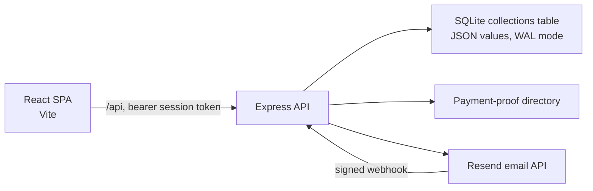

# System Audit

## Scope And Method

This document is a source review of the React client, Express API, SQLite store, and local configuration in this repository. It describes behaviour visible in source as of the audit. It does not replace penetration testing, dependency scanning, load testing, or a review of deployed infrastructure.

## Executive Summary

TechLabs Academy SA is a single-deployment training and admissions application. A React/Vite SPA communicates with an Express API under `/api`; the API owns authentication, admissions, payment-proof handling, mail delivery, document generation, and data persistence.

The system has sensible baseline controls for a small deployment: password hashes use scrypt, sessions and one-time tokens are stored as hashes, endpoints are role-scoped, sensitive bank details are excluded from public data, payment files are signature-checked, and selected public/authentication endpoints are rate-limited. The immediate operational priorities are reliable backups, a payment-proof retention policy, production secret management, and an explicit capacity plan before growing beyond a single API process.

## Architecture

### Client

- [src/main.tsx](src/main.tsx) mounts the React application.
- [src/App.tsx](src/App.tsx) implements client-side, hash-compatible path selection for public, student, and admin pages.
- [src/context/AppContext.tsx](src/context/AppContext.tsx) coordinates client state and calls the API helpers in [src/lib/api.ts](src/lib/api.ts).
- Browser sessions use an `HttpOnly`, `Secure` production cookie with `SameSite=None` for the separate frontend/API origins. Mutating cookie-authenticated requests require a double-submit CSRF token. Bearer authentication remains accepted temporarily for compatibility, but the frontend no longer stores session tokens in `localStorage`.

### API And Services

- [server/index.ts](server/index.ts) is the API entry point. It configures CORS, JSON handling, authentication, role checks, per-IP in-memory rate limits, upload handling, and the HTTP routes.
- Server services handle email automation, bulk operations, invoices/documents, and payment reminders.
- Resend is optional at runtime: mail delivery returns a configuration failure when `RESEND_API_KEY` or `EMAIL_FROM` is absent. Delivery status webhooks are verified with `RESEND_WEBHOOK_SECRET`; unsigned webhook requests return `401`.

### Persistence

- [server/data/store.ts](server/data/store.ts) opens `server/data/techlabs.db` by default, or `TECHLABS_DB_PATH` when configured, and enables SQLite WAL mode.
- The schema is one SQLite `collections` table. Each business collection is JSON-serialized into one row; `getDatabase()` materializes the entire logical database and `saveDatabase()` writes all collections in one transaction.
- Payment proof files are stored separately in `server/data/payment-proofs/` by default, or in `PAYMENT_PROOF_DIR`.
- Seed data is written when a collection is absent, empty, `null`, or matches a legacy data marker. A production database must be initialized and backed up deliberately, rather than treated as an immutable migration-based schema.

## Access Model

| Actor | Authentication | Principal capabilities |
| --- | --- | --- |
| Visitor | None | View public catalogue, submit leads/applications, validate certificates. |
| Student | Email/password after a time-limited, single-use account link | View only their portal data; submit payment proof and download authorised documents. |
| Administrator | Configured admin credentials or an active staff account | Admissions decisions, payment review, staff/data administration, reporting, settings, audit activity, and operational automation. |
| Instructor | Active staff account | Privileges are granted where endpoints allow instructor/admin access. |

Student and staff passwords are scrypt-derived. Session, setup, verification, reset, and magic-login tokens are stored only as SHA-256 hashes. Sessions persist in the data store and are checked for expiry on each protected request; the configured lifetime is eight hours.

## Core Workflows

### Admissions To Enrollment

1. A visitor submits an application.
2. An administrator records an admissions decision and the system can issue an invoice and relevant notification.
3. The student provisions or resets an account through a one-time link, verifies email, and signs in.
4. The student uploads an EFT proof. The API accepts PDF, JPEG, and PNG payloads up to its configured limits and checks their file signatures.
5. An administrator verifies or rejects the proof. Verification updates payment/enrollment state and can trigger notifications and payment-plan updates.

### Mail And Documents

The service sends transactional mail through Resend and records provider message identifiers and delivery statuses where available. The API produces invoice and other branded documents; access to private student documents is mediated by the authenticated API rather than direct static files.

## Configuration And Local Operation

Requirements: Node.js 20+ and npm.

1. Copy `.env.example` to `.env` and replace every placeholder.
2. Run `npm install`.
3. Start the API with `npm run dev:server` on port `4000`.
4. Start the SPA in a separate terminal with `npm run dev` on port `3000`.
5. Open `http://localhost:3000`.

`npm run lint` runs TypeScript validation; `npm run build` creates the Vite production bundle. `.env`, SQLite files, payment proofs, and build output are excluded by [.gitignore](.gitignore). `npm run clean` deletes `dist` and the default local database, so it must never be used against production data.

Production configuration requires exact values for `APP_ORIGIN`, `ADMIN_EMAIL`, `ADMIN_PASSWORD`, `RESEND_API_KEY`, `RESEND_WEBHOOK_SECRET`, `EMAIL_FROM`, `EMAIL_REPLY_TO`, and an appropriate persistent path for database/proof storage. Serve the client and API behind HTTPS, restrict firewall access to the API, and configure the hosting platform to rewrite SPA routes to `index.html`.

## Findings And Recommendations

### High Priority

1. **Establish backup and recovery.** No backup or restore automation is present. Back up both the SQLite database and payment-proof directory together, encrypt backups, test a restore, and set a recovery point and recovery-time objective.
2. **Define data retention and deletion.** Payment proofs and personal admissions records have no visible automated retention or deletion process. Document retention periods, access owners, secure deletion, and a process for privacy/data-subject requests before processing real learner records at scale.
3. **Treat the deployment as single-process.** Rate-limit state and the enrollment serialization queue are in process memory. Multiple API instances would not share these controls, and process restarts clear rate limits. Use a shared rate-limit/queue service before horizontal scaling.
4. **Protect production secrets.** `.env` is correctly ignored, but secrets must be supplied by the hosting platform's secret manager and rotated on exposure. Do not put secrets in `VITE_` variables, source, build artifacts, or logs.

### Medium Priority

1. **Plan a persistence migration before sustained growth.** The current store reads and writes every JSON collection for a logical update. WAL improves SQLite read/write behavior but does not remove this application-level full-dataset rewrite pattern. Introduce normalized tables and targeted updates, or migrate to a managed relational database, before concurrent administrative use becomes routine.
2. **Set explicit file-storage controls.** Use storage quotas/monitoring, antivirus or malware scanning appropriate to the platform, encrypted persistent volumes, and non-guessable file paths. File-signature checks are useful but are not malware detection.
3. **Harden browser token handling.** The application now uses secure `HttpOnly` cookies, CSRF validation, restrictive browser security headers, and no frontend token persistence. Keep `APP_ORIGIN` exact, set `NODE_ENV=production`, serve both origins over HTTPS, and remove bearer compatibility after all clients have migrated.
4. **Make audit logs durable and queryable.** Audit entries are part of the same JSON collection and the admin route limits returned records. Define retention, export, pagination, and restricted operational access for investigations.
5. **Add deployment health monitoring.** Monitor `/api/health`, database/file-volume capacity, failed email deliveries, failed proof writes, and application error rates. Alert on backup failures and a missing email webhook secret.

### Validation Gaps

No automated test script is defined in [package.json](package.json). Add API tests for role isolation, session expiry, one-time token consumption, payment-proof ownership, webhook signature rejection, and enrollment/payment transitions. Add an end-to-end browser test for the application-to-student-login path, and run dependency/security scanning in CI.

## Production Readiness Checklist

- [ ] All configuration values come from a managed secret store; default credentials are unavailable.
- [ ] HTTPS, exact `APP_ORIGIN`, reverse-proxy settings, and SPA fallback are tested.
- [ ] Resend domain, sender, signed webhook, and bounce/complaint handling are configured.
- [ ] Encrypted, monitored backups of the database and proof directory have passed a restore test.
- [ ] Retention, deletion, incident response, and payment-verification procedures have named owners.
- [ ] Capacity/load testing validates the expected number of concurrent applicants and staff.
- [ ] CI runs TypeScript, build, API authorization tests, and dependency scanning.